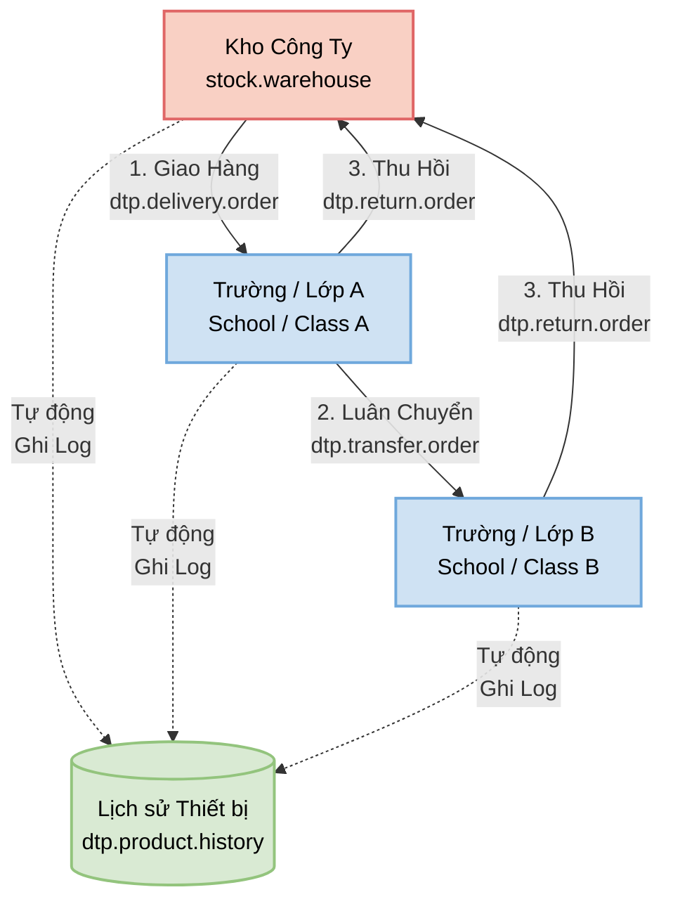

# DTP Project Documentation

## Tổng quan dự án (Project Overview)

Dự án DTP là một bộ ứng dụng chạy trên nền tảng Odoo ERP, được thiết kế chuyên biệt để quản lý quá trình cấp phát, thu hồi và luân chuyển thiết bị, giáo cụ (dụng cụ giảng dạy) cho hệ thống các trường học, lớp học.

Dự án này mở rộng không chỉ tính năng quản lý sản phẩm thông thường mà còn quản lý cấu trúc trường học (Cấp học, Khối, Môn học, Lớp học, Giáo viên) và theo dõi chính xác vòng đời của sản phẩm khi rời khỏi kho để đến sử dụng thực tế tại từng lớp học cụ thể.

## Kiến trúc Modules (Module Architecture)

Hệ thống bao gồm 3 module chính phụ thuộc lẫn nhau:

1. **`dtp_stock_management`**: Quản lý thông tin thiết bị và bộ dụng cụ.
2. **`dtp_school_management`**: Quản lý thông tin và cấu trúc trường học.
3. **`dtp_delivery_management`**: Quản lý các nghiệp vụ kho và giao nhận dành riêng cho trường học.

---

### 1. DTP Stock Management (`dtp_stock_management`)

Module nền tảng mở rộng từ module `stock` của Odoo để phục vụ cho các sản phẩm giáo dục.

**Các objects/models chính:**
- **Product Template (`product.template`)**: Kế thừa để thêm cờ đánh dấu `is_teaching_product` (Sản phẩm dạy học), thông tin `subject_area` (Môn học), `grade_level` (Khối lớp) và `teaching_note` (Ghi chú giảng dạy).
- **Teaching Kit (`dtp.teaching.kit`) & Teaching Kit Line (`dtp.teaching.kit.line`)**: Group nhiều sản phẩm giảng dạy thành các **Bộ dụng cụ**. Bộ dụng cụ được gắn với kho cụ thể, có danh sách thành phần rõ ràng.

### 2. DTP School Management (`dtp_school_management`)

Module quản lý cấu trúc đối tác (được hiểu là Trường học) một cách chuyên sâu. Dựa trên `dtp_stock_management` và `contacts`.

**Các objects/models chính:**
- **School (`dtp.school`)**: Quản lý thông tin trường học (Mã, tên, phân vùng, người phụ trách trường, sale phụ trách). Mỗi trường liên kết với các đơn hàng giao/thu hồi/luân chuyển của nó.
- **School Salesperson (`dtp.school.salesperson`)**: Quản lý danh sách các nhân viên tư vấn/Sale phụ trách trường.
- **School Grade (`dtp.school.grade`)**: Quản lý danh mục khối/lớp (Ví dụ: Khối 1, Khối 2...) và cấp học (Mầm non, Tiểu học, Trung học).
- **School Subject (`dtp.school.subject`)**: Danh mục môn học.
- **School Class (`dtp.school.class`)**: Quản lý lớp học cụ thể trong một trường học. Một lớp có cấp học, khối, giáo viên chủ nhiệm, sĩ số và các bộ dụng cụ (`toolkit_ids`) được trang bị.

### 3. DTP Delivery Management (`dtp_delivery_management`)

Module core quản lý luân chuyển các thiết bị giáo dục, theo dõi chặt chẽ nguồn gốc và điểm đến cuối cùng của sản phẩm.

**Các chức năng nghiệp vụ và models chính:**

- **Giao hàng (`dtp.delivery.order`)**: 
  - Tạo đơn giao hàng từ kho gốc tới Trường và Lớp học cụ thể.
  - Tự động sinh `stock.picking` ở Odoo (Phiếu xuất kho) từ `Lot/Stock` ra `Customer Location`.
  - Tích hợp lịch sử phân phối tới `dtp.product.history`.
  - Có các trạng thái (Nháp -> Đang giao -> Đã giao / Đã hủy).
  
- **Thu hồi (`dtp.return.order`)**: 
  - Tạo đơn thu hồi thiết bị từ Trường học về kho công ty.
  - Tự động sinh `stock.picking` (Phiếu nhập kho) từ `Customer Location` về `Lot/Stock`.
  - Tích hợp ghi nhận vào `dtp.product.history`.

- **Luân chuyển (`dtp.transfer.order`)**: 
  - Cho phép luân chuyển thẳng thiết bị từ Trường/Lớp A sang Trường/Lớp B mà không cần qua kho hay làm phiếu trả và xuất lại.
  - Ghi nhận đầy đủ vào log lịch sử.

- **Lịch sử thiết bị (`dtp.product.history`)**: 
  - Ghi nhận chi tiết mọi hoạt động Giao (Delivery), Thu hồi (Return), Luân chuyển (Transfer).
  - Giúp User có thể trace được thiết bị đang ở trường nào, từ đợt phát nào hoặc đã trả về kho ngày nào.

---

## Luồng nghiệp vụ cơ bản (Business Workflow)

1. **Chuẩn bị Dữ Liệu Nền:**
   - Tạo sản phẩm (`product.template`), tick chọn "Sản phẩm dạy học".
   - (Tuỳ chọn) Đóng gói các sản phẩm thành "Bộ dụng cụ".
   - Khởi tạo thông tin hệ thống các Trường, Cấp học, Khối và Lớp học cụ thể có trong các Trường.
2. **Cấp Phát Thiết Bị:**
   - Lập Đơn Giao Hàng (`dtp.delivery.order`) chọn đích đến là Trường học / Lớp học cụ thể.
   - Xác nhận đơn -> Tạo `stock.picking` xuất kho.
   - Cập nhật trạng thái "Đã giao" -> Hệ thống tự động ghi lại lịch sử phân bổ.
3. **Luân Chuyển Thiết Bị (Giữa năm học / giữa kỳ):**
   - Lập Đơn Luân Chuyển (`dtp.transfer.order`) chọn thông tin nguồn (School/Class A) và thông tin đích (School/Class B).
   - Xác nhận đơn -> Ghi log lịch sử luân chuyển.
4. **Thu hồi Thiết Bị (Cuối khóa / Hỏng hóc):**
   - Lập Đơn Thu Hồi (`dtp.return.order`).
   - Xác nhận đơn -> Tạo `stock.picking` nhập rác/về kho vật lý.
   - Đánh dấu hoàn tất -> Ghi log lịch sử thu hồi thiết bị.

## Lưu ý về Kỹ Thuật (Technical Notes)

- Ứng dụng tuân thủ chuẩn Odoo models và view inheritance.
- File XML tuân thủ security của `ir.model.access.csv`.
- Các hành động kho (Tạo/Confirm Stock Picking) được can thiệp tự động ở Python thông qua Odoo ORM (`action_confirm`, `action_assign` của module Delivery Management). Không yêu cầu thao tác tay chuyển Delivery Odoo truyền thống mà qua màn hình UI customize DTP.
